# ENPM 611 Class Project - Group 2

Group Members:

- Kevin Zong
- Michael Obajemu
- Anh Vu

## Task 1: Domain Model

#### Entity Relationship Diagram

## Task 2: Application Design

#### Class Diagram

## Analyses

### 1. Average Resolution Time vs Number of comments

**Insight:** Do issues with more discussion get resolved faster or slower?

**Input:** Label (optional)

**Output:** Line graph

- X axis - Engagement (number of comments)
- Y axis - Average resolution time (days)
- Each dot represents an issue.
  - If no label is inputted, all issues will be plotted.
  - If a label is inputted, only issues with that label will be plotted.

### 2. Issue Reopen Rate

**Insight:** Which types of issues are most likely to be reopened?

**Input:** None

**Output:** Bar chart

- X axis - Labels
- Y axis - % of issues that get reopened

### 3. Top contributors' specialties

**Insight:** Who are the most active contributors and what types of issues do they spend their time on?

**Input:** None

**Output:** A ranked list of contributors and the distribution of issue types they handle.

- A user handles an issue if they've closed, commented on, or been assigned to an issue.

## To Do's:

### Kevin

- Complete Analysis #1

### Anh

- Complete Analysis #3

### Michael

- Complete Analysis #2
